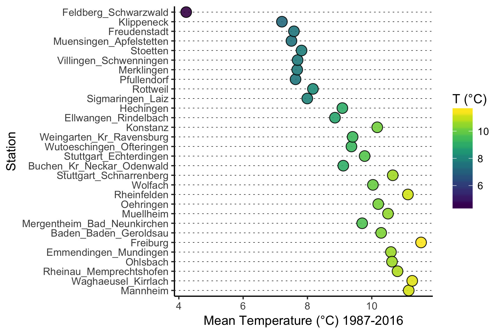

## Climate indices

Downloads of all R functions (see section above) for the Climate Indices in Frich et al. (2002).
You can report issues in the Issue section above. Please be friendly to other groups.

## Stations in BW 

## Bugs
 1. If you find a bug please report it to the group that is responsible for the function.
 2. If you have a Github account, you can create an `Issue` here and everybody can work on the problem.

## Updates

 1. You can provide updates of your R function by e-mail. Just send the new code to the lecturer.
 2. If you have a Github account you can a) `fork` the repository and then b) `commit` changes and create a `pull request` to be reviewed by the lecturers.
 
## Master script for all indices

Based on `climate_indices.R` volunteers can now develop a little helper script to calculate all indices (averages and rate of change) at once. Please contribute to that group work, if you have some time left ;)

## Submit changes/new files with GitHub in a nutshell (from M. Maelicke)
  1. Create a GitHub account 
  2. fork the main course [project](https://github.com/modche/datacourse2018)
  3. use *your fork* to create a project in RStudio
  4. Commit and push changes into your copy. You can also invite other to collaborate on your copy.
  5. Once your're finished, create a *pull request* from your project into the main project. We will review and comment your changes. In case we are satisfied, this pull is accepted and will be merged into the main project.
  6. In case the main project got updated, you can *pull request* the main projcet into your fork and directly accept this merge. Then pull the latest verision in RStudio and voilá.
 
